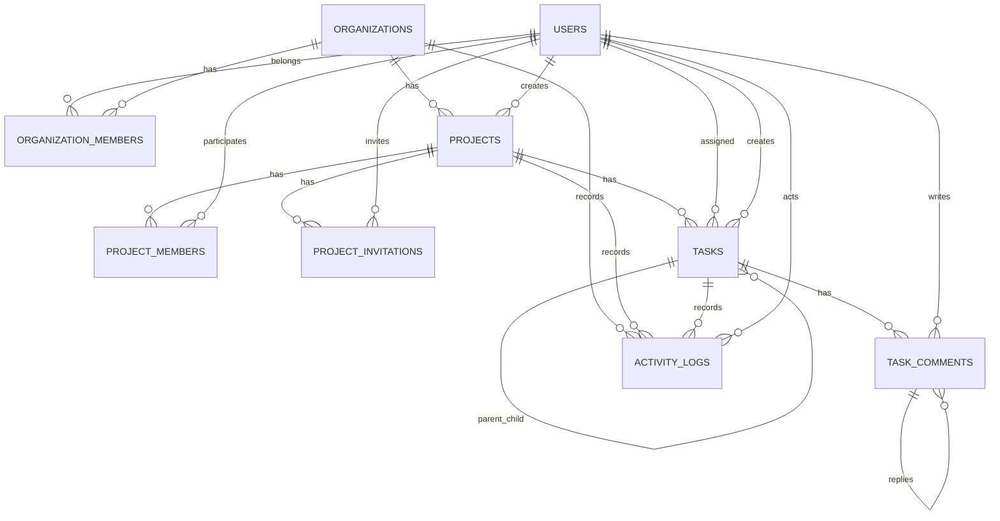

# クラウドガントチャート / WBS 管理システム 開発仕様書

> Codex 実装用仕様書  
> 想定技術: Laravel + Blade + Bootstrap + Vanilla JavaScript/AJAX + Laravel Reverb/Echo  
> DB: MySQL または PostgreSQL を想定  
> 本仕様では Laravel / Eloquent の標準的な命名・Migration・Policy・Notification・Queue・Broadcasting の流儀を優先する。

---

## 1. システム概要

本システムは、Backlog のようなプロジェクト・タスク・コメント管理と、Microsoft Project / tdchart2 系の WBS・ガントチャート操作を組み合わせた、クラウド型プロジェクト管理システムである。

主要要件は以下。

- 事業者単位でユーザー・プロジェクトを管理する。
- 1プロジェクトに複数のPMを登録できる。
- PMとメンバーは招待メールからアカウントを有効化できる。
- HOME画面とWBS画面は同一DBを参照し、常に同期する。
- タスクの日付・担当者・進捗率・ステータス等はAJAXで更新する。
- 他ユーザーへのリアルタイム反映は Laravel Reverb + Laravel Echo により行う。
- コメント投稿および進捗率変更時は、対象プロジェクトの参加メンバーへメール通知する。
- メール送信はQueue経由とし、画面操作をブロックしない。
- プロジェクト・タスク等の通常の削除は Soft Delete とし、監査ログを残す。
- UIはBootstrapをベースにした、軽量でモダンなフラットデザインとする。
- Backlog / MS Project / tdchart2 を参考にしてよいが、画面をピクセル単位でコピーせず、本システム独自のUIとして構成する。

---

# 2. 技術方針

## 2.1 バックエンド

- Laravel
- Eloquent ORM
- Blade
- Laravel Policy / Gate
- Form Request Validation
- Laravel Notification
- Laravel Queue
- Laravel Events / Broadcasting
- Laravel Reverb
- Laravel Echo

Controllerへ業務ロジックを詰め込みすぎないこと。

複雑な処理は必要に応じて以下へ分離する。

```text
app/
├── Actions/
│   ├── Projects/
│   ├── Tasks/
│   └── Invitations/
├── Enums/
├── Events/
├── Http/
│   ├── Controllers/
│   └── Requests/
├── Models/
├── Notifications/
├── Policies/
└── Services/
```

例:

- `CreateProjectAction`
- `UpdateProjectAction`
- `CreateTaskAction`
- `UpdateTaskAction`
- `AcceptProjectInvitationAction`
- `ChangeTaskProgressAction`

## 2.2 フロントエンド

原則として以下を使用する。

- Blade
- Bootstrap
- Bootstrap Icons
- Vanilla JavaScript
- Fetch API または Axios のどちらかに統一
- Vite
- Laravel Echo

React/Vueによる全面SPA化は初期版では行わない。

HOMEやタスク編集画面はBlade中心とし、WBSのインタラクティブ部分のみJavaScriptを多用する。

---

# 3. デザイン指示

## 3.1 Bootstrapを利用したフラットデザイン

Bootstrapをベースに、業務システムらしい読みやすさを維持しながら、古臭くないモダンなフラットデザインにする。

### 基本方針

- グラデーションを多用しない。
- 強いドロップシャドウを多用しない。
- 面、余白、罫線、タイポグラフィで情報階層を表現する。
- Border Radiusは軽く使用してよい。
- Bootstrap Cards、Dropdown、Modal、Offcanvas、Popover、Toastを適宜利用する。
- アイコンはBootstrap Iconsを優先する。
- 操作ボタンにはアイコンとツールチップを併用する。
- 破壊的操作は赤系ボタンと確認ダイアログを使用する。
- 主操作は目立つが派手すぎないアクセントカラーを使用する。
- タスク表・WBSは情報密度を優先し、カードを過度に多用しない。
- PCブラウザでの利用を主対象とする。
- HOME等はレスポンシブ対応する。
- WBSは横スクロールを前提としたデスクトップファーストUIとする。

### Bootstrap導入例

```bash
npm install bootstrap @popperjs/core bootstrap-icons
npm run dev
```

Vite経由で `resources/js/app.js` / `resources/css/app.css` に読み込む。

CSSカスタマイズはCSS Variablesを活用し、WBS固有の色は一か所で変更できるようにする。

例:

```css
:root {
    --wbs-future: #7CFC00;
    --wbs-past: #6f5bd3;
    --wbs-overdue: #dc3545;
    --wbs-completed: #87CEEB;
    --wbs-grid: #111111;
}
```

上記は初期値であり、可読性に問題がある場合は近似色へ微調整してよい。

---

# 4. アカウント・権限仕様

## 4.1 システム管理者

システム全体を管理する。

可能な操作:

- 全事業者の一覧・詳細閲覧
- 全事業者のプロジェクト閲覧
- 全タスク閲覧
- 全データの編集
- プロジェクト・タスク等の削除
- Soft Deleteされたデータの復元
- 必要時の完全削除
- 事業者の利用停止 / 再開
- 個別ユーザーの利用停止 / 再開
- 監査ログ閲覧

`users.is_system_admin = true` で管理する。

システム管理者権限は通常のorganization/project roleとは別レイヤーとする。

Policyでは `Gate::before()` 等を用いてシステム管理者を最上位権限として扱ってよい。

---

## 4.2 代表者（Owner）

事業者の代表者。

初回登録時は自分で以下を入力する。

- 名前
- メールアドレス
- パスワード
- 事業者名

代表者は所属事業者内の全プロジェクトへアクセスできる。

可能な操作:

- プロジェクト作成
- プロジェクト編集
- プロジェクト開始日・終了日変更
- プロジェクト削除（Soft Delete）
- PM選択
- PM招待
- PM追加・変更
- メンバー招待
- タスク作成
- タスク編集
- タスク削除
- タスク担当者変更
- タスク開始日変更
- タスク終了日変更
- タスク進捗率変更
- タスクステータス変更
- コメント投稿

代表者自身をプロジェクトPMとして登録することも可能。

---

## 4.3 PMアカウント

PMは事業者に所属するPM権限ユーザー。

### 基本権限

- プロジェクト作成
- 自分が参加するプロジェクトの編集
- プロジェクト日程変更
- プロジェクト削除（Soft Delete）
- 既存PMをプロジェクトへ追加
- プロジェクトメンバー招待
- タスク作成
- タスク編集
- タスク削除
- タスク担当者変更
- タスク開始日変更
- タスク終了日変更
- タスク進捗率変更
- タスクステータス変更
- コメント投稿

### PM権限の昇格ルール

一般メンバーを「事業者レベルのPMアカウント」へ昇格させる権限は、原則として以下のみ。

- システム管理者
- 代表者

既存PMは、既にPMアカウントであるユーザーを自分のプロジェクトへ追加できる。

既存PMが一般メンバーを勝手に事業者全体のPMへ昇格させないこと。

---

## 4.4 メンバーアカウント

PMまたは代表者からプロジェクトへ招待される。

可能な操作:

- 参加プロジェクト閲覧
- タスク作成
- タスク名・説明編集
- タスク担当者変更
- タスク開始日変更
- タスク終了日変更
- タスク進捗率変更
- タスクステータス変更
- コメント投稿

初期仕様では以下は不可。

- 新規プロジェクト作成
- プロジェクト削除
- PM権限の付与
- タスク削除

---

# 5. 複数PM仕様

この仕様は固定要件とする。

**1つのプロジェクトに複数人のPMを登録できる。**

`projects` テーブルへ `pm_id` を持たせてはならない。

PM・メンバーの所属は `project_members` により管理する。

例:

```text
Project A
├── PM
│   ├── 山田
│   ├── 佐藤
│   └── 鈴木
└── Member
    ├── 高橋
    └── 田中
```

同一ユーザーが、

```text
Project A -> pm
Project B -> member
```

となることも可能。

事業者レベルのアカウント権限と、プロジェクト単位の役割は分離する。

---

# 6. 招待フロー

## 6.1 PM招待

代表者はPMをメールで招待できる。

フロー:

```text
代表者
  ↓
PMのメールアドレス入力
  ↓
招待メール送信
  ↓
招待URL
  ↓
招待画面
  ↓
名前・パスワード設定
  ↓
アカウント確定
  ↓
organization_members に PM として追加
  ↓
project_members に PM として追加
```

メールアドレスは招待先のアドレスを固定表示し、招待画面で自由変更させない。

既に同一メールの `users` レコードが存在する場合は新規Userを作らず、ログイン後に招待を承認して所属情報のみ追加する。

## 6.2 メンバー招待

代表者またはPMがプロジェクトメンバーを招待する。

新規ユーザーの場合:

```text
招待メール
  ↓
招待URL
  ↓
名前・パスワード設定
  ↓
organization_members = member
  ↓
project_members = member
```

既存ユーザーの場合は所属のみ追加する。

## 6.3 招待トークン

招待には以下を実装する。

- 推測困難なランダムトークン
- DBには生トークンではなく `token_hash` を保存
- 有効期限
- `accepted_at`
- `revoked_at`
- 一度利用した招待URLは再利用不可
- 招待取消
- 招待再送

---

# 7. HOME UI仕様

HOMEはBacklogを参考にしたプロジェクト中心の構造とする。

## 7.1 HOME第一階層

プロジェクト一覧を表示。

例:

```text
-------------------------------------------------
Cloud Project Manager
-------------------------------------------------

[ + プロジェクト作成 ]

プロジェクト
┌─────────────────────────────────┐
│ ECサイトリニューアル            │
│ PM: 山田 / 佐藤                  │
│ 2026/09/01 - 2026/12/20         │
│ 進捗 42%                         │
└─────────────────────────────────┘

┌─────────────────────────────────┐
│ 社内システム刷新                 │
│ PM: 鈴木                         │
│ 進捗 67%                         │
└─────────────────────────────────┘
```

HOMEからプロジェクト別ページへ遷移する。

---

# 8. プロジェクト作成UI

プロジェクト作成時に複数PMを選択できる。

例:

```text
新しいプロジェクト

プロジェクト名 *
[                              ]

説明
[                              ]

開始日
[ yyyy/mm/dd ]

終了予定日
[ yyyy/mm/dd ]

PM
[ PMを検索... ]

☑ 自分
☑ 山田 太郎
☐ 佐藤 花子
☑ 鈴木 一郎

[ + 新しいPMを招待 ]

[キャンセル] [プロジェクト作成]
```

PM選択UIは検索可能な複数選択UIとする。

PM自身がプロジェクトを作成する場合は、自分をPMとしてデフォルト選択状態にする。

新規PMを招待する場合でもプロジェクト自体は作成可能とし、招待承認待ち状態を表現できるようにする。

---

# 9. プロジェクト詳細画面

プロジェクトページには少なくとも以下を表示する。

```text
プロジェクト名

PM: 山田 / 佐藤
期間: 2026/09/01 - 2026/12/20

[タスク作成]
[メンバー招待]
[プロジェクト編集]
[タスク一覧]
[WBSを開く]
[メニュー]
```

タスク一覧では以下を表示。

- タスク名
- 担当者
- 開始日
- 終了日
- 進捗率
- ステータス

タスク名はタスク詳細画面へのリンクとする。

---

# 10. タスク詳細画面

タスク詳細画面には以下を用意する。

- タスク名変更フォーム
- 説明
- 担当者ドロップダウン
- 開始日カレンダー
- 終了日カレンダー
- 進捗率入力
- ステータスドロップダウン
- スレッド式掲示板
- 更新履歴

ステータス:

```text
着手前   = not_started
着手中   = in_progress
レビュー = review
終了     = completed
```

---

# 11. タスクコメント / 掲示板

タスクごとにスレッド式掲示板を持つ。

コメントには返信を付けられる。

例:

```text
山田:
API実装が完了しました。

└ 佐藤:
  レビューします。

  └ 山田:
    お願いします。
```

`task_comments.parent_id` による自己参照を使用する。

コメント投稿時、対象プロジェクトに参加しているメンバーへタスクURL付きメール通知をQueueで送信する。

---

# 12. 進捗率変更通知

タスク進捗率変更時も、対象プロジェクト参加者へメール通知を行う。

メールには以下を含める。

- プロジェクト名
- タスク名
- 変更者
- 変更前進捗率
- 変更後進捗率
- タスク詳細画面URL

メール送信は同期処理にしない。

Notification + Queueを利用する。

---

# 13. WBS画面概要

HOMEの上部ナビゲーション等から `WBS` へ遷移できる。

WBSはMS Project / tdchart2系の画面構造を参考にする。

## 13.1 左側ペイン

左側に以下を階層表示。

```text
▼ Project A
   ▼ 設計
      DB設計        山田    100%   [終了 ▼]
      UI設計        佐藤     70%   [着手中 ▼]
   ▼ 開発
      API実装       鈴木     40%   [着手中 ▼]
      Frontend      山田     20%   [着手前 ▼]
```

表示項目:

- プロジェクト名
- タスク名
- 担当者
- 進捗率
- ステータスドロップダウン

左ペインは横スクロールに追従せず固定する。

---

# 14. WBSプロジェクト操作

WBS左上に `プロジェクト作成` ボタンを配置する。

HOMEで作成されたプロジェクトはWBSにも自動的に表示される。

プロジェクト行にはフォルダアイコンを表示する。

プロジェクトのフォルダアイコンまたはプロジェクト名を右クリックするとコンテキストメニューを表示。

最低限のメニュー:

- プロジェクト削除
- メンバー招待
- タスク追加

通常の左クリックは選択または展開/折りたたみとする。

ブラウザ標準右クリックメニューは該当要素上では抑止する。

---

# 15. WBSの日付列

右側ペインには日付列を左から右へ並べる。

例:

```text
8/31 | 9/1 | 9/2 | 9/3 | 9/4 | ...
```

日付ヘッダ文字は縦書き表示を基本とする。

縦列と横行を交差させ、1日1マスのグリッドを形成する。

- グリッド罫線は黒
- 日付ヘッダはSticky
- 左側のタスク情報もSticky
- 右側のみ横スクロール
- 今日の日付が一目で分かる表示を追加する
- 今日列はヘッダに「TODAY」等の小ラベル、または通常より太い境界線を用いる
- 色だけに依存しない

---

# 16. WBSタスクバーの色仕様

タスクの `start_date` から `end_date` まで該当マスを塗る。

色はDBへ保存せず、タスク状態と日付から表示時に計算する。

優先順位:

```text
1. completed
2. overdue
3. past
4. future
```

## 16.1 終了タスク

`status = completed`

タスクバー全体をスカイブルー。

## 16.2 期限超過

未完了かつ終了予定日を過ぎた部分を赤色。

終了予定日の翌日から今日までを遅延領域として視覚化する。

## 16.3 過去の日付

未完了タスクの今日より前の実行期間は青紫。

## 16.4 今日以降

未完了タスクの今日以降の予定部分はライムグリーン。

例:

```text
開始         終了予定      今日
|--------------|------------|
青紫青紫青紫   赤赤赤赤赤
```

未来部分が残っている場合はライムグリーン。

---

# 17. WBS進捗率ゲージ

色付きのタスクバーの上に細い黒線で進捗ゲージを表示する。

例:

```text
██████████████████████████████
━━━━━━━━━━━━━━━━━━● 60%
```

要件:

- 線は黒
- タスク期間幅に対して0～100%を表す
- 右端に進捗率 `60%` のように表示
- ゲージ端を左右ドラッグして進捗率を変更できる
- ドラッグ中は画面上で即座にプレビュー
- ドロップ時にサーバーへ保存
- 0～100の整数値
- HOME / タスク詳細 / WBSの値は同じ `tasks.progress` を参照する

---

# 18. WBS上の日程操作

タスク選択時に画面上部へ日程操作ツールバーを表示する。

最低限以下の4操作をアイコンボタンとして設置。

- 開始日を1日早める
- 開始日を1日遅らせる
- 終了日を1日早める
- 終了日を1日遅らせる

Bootstrap Iconsを利用し、各アイコンにはTooltipを付ける。

またタスク選択時、開始日・終了日をカレンダーUIから直接変更可能にする。

---

# 19. WBS上の進捗入力

タスク選択時に進捗率入力UIを表示する。

以下の両方を可能にする。

- 数値入力
- WBS上の黒い進捗ゲージをドラッグ

変更値は同じAPIへ送信する。

---

# 20. WBS上のステータス変更

タスク名横にステータスのDropdownを表示する。

選択肢:

- 着手前
- 着手中
- レビュー
- 終了

選択変更後、ページ全体を再読込せずAJAXで即保存する。

保存成功後は同じプロジェクトを開いている他ユーザーにもリアルタイム反映する。

---

# 21. レビュー運用

想定運用:

```text
作業者
  ↓
作業実施
  ↓
status = review
  ↓
担当者をレビュアーへ変更
  ↓
レビュー
  ↓
必要に応じて元の作業者へ担当を戻す
  ↓
status = completed
```

担当者変更履歴は `activity_logs` に記録する。

---

# 22. HOME / WBS 同期

HOMEとWBSで別々のデータを保持してはならない。

どちらも同じ、

- `projects`
- `project_members`
- `tasks`

を参照する。

例:

```text
WBSで進捗 40 -> 60
        ↓
tasks.progress = 60
        ↓
HOMEを開いている他ユーザーへBroadcast
        ↓
HOMEの進捗表示も60へ更新
```

---

# 23. AJAX / API更新方針

更新はHTTPを正とする。

例:

```http
PATCH /projects/{project}/tasks/{task}
```

部分更新を許可する。

例:

```json
{
    "progress": 75,
    "lock_version": 7
}
```

または用途別エンドポイントを用意してもよい。

```text
PATCH /tasks/{task}/progress
PATCH /tasks/{task}/schedule
PATCH /tasks/{task}/assignee
PATCH /tasks/{task}/status
```

Codex実装時はRESTとして不自然な重複を避け、保守しやすいルーティングへ整理すること。

重要:

**WebSocketをDB更新の代替にはしない。**

```text
ブラウザ
  ↓ AJAX/PATCH
Laravel
  ↓
Validation / Policy
  ↓
DB Transaction
  ↓
COMMIT
  ↓
Broadcast Event
  ↓
Laravel Reverb
  ↓
他ユーザー
```

という流れにする。

---

# 24. リアルタイム同期

Laravel Reverb + Laravel Echoを利用する。

Broadcastingの基本単位はプロジェクト。

例:

```text
private-project.{projectId}
```

Private Channelの認可時に、以下のいずれかを確認する。

- システム管理者
- 対象Organizationのowner
- `project_members` に対象ユーザーが存在

Broadcast対象例:

- ProjectUpdated
- ProjectDeleted
- TaskCreated
- TaskUpdated
- TaskDeleted
- TaskProgressUpdated
- TaskScheduleUpdated
- TaskAssigneeUpdated
- TaskStatusUpdated
- TaskCommentCreated

イベントには画面全体を送り直さず、更新対象IDと必要な最小データを含める。

BroadcastはDB Commit後に行う。

---

# 25. 同時編集

タスク等には楽観ロック用 `lock_version` を持たせる。

例:

```text
DB:
progress = 40
lock_version = 7
```

Request:

```json
{
    "progress": 60,
    "lock_version": 7
}
```

正常更新時:

```text
progress = 60
lock_version = 8
```

別ユーザーが古い `lock_version = 7` で更新した場合は HTTP 409 Conflict を返す。

クライアント側は最新情報を再取得し、

```text
別のユーザーによって更新されています。最新の内容を表示しました。
```

等のToastを表示する。

`projects` と `tasks` に `lock_version` を持たせる。

---

# 26. 削除仕様

通常の削除はSoft Delete。

対象:

- users
- organizations
- projects
- tasks
- task_comments

`deleted_at` を利用する。

PMまたは代表者がプロジェクトを削除する場合は確認モーダルを表示する。

例:

```text
「ECサイトリニューアル」を削除しますか？

タスク: 57件
コメント: 218件
メンバー: 12人

この操作ではプロジェクトをゴミ箱へ移動します。

[キャンセル] [削除]
```

システム管理者のみ完全削除を可能にする。

監査ログは原則削除しない。

---

# 27. 監査ログ

主要な操作は `activity_logs` へ記録する。

最低限記録する項目:

- 操作者
- 事業者
- プロジェクト
- タスク
- アクション
- 変更前
- 変更後
- IP
- User Agent
- 日時

例:

```text
2026/08/31 10:20
山田
進捗率 40% -> 60%

2026/08/31 10:25
佐藤
担当者 山田 -> 佐藤

2026/08/31 11:32
佐藤
ステータス 着手中 -> レビュー
```

JSONカラム:

```json
old_values = {
    "progress": 40
}

new_values = {
    "progress": 60
}
```

---

# 28. DB / ER構成

## 28.1 Laravel命名規則

原則:

- Model: 単数PascalCase
- Table: 複数snake_case
- PK: `id`
- FK: `{model}_id`
- Timestamp: `created_at`, `updated_at`
- Soft Delete: `deleted_at`

例:

```text
Organization -> organizations
OrganizationMember -> organization_members
Project -> projects
ProjectMember -> project_members
TaskComment -> task_comments
```

---

# 29. ER図



---

# 30. users

Laravel標準Userを拡張する。

```text
users
--------------------------------------------------
id                  bigint PK
name                varchar
email               varchar unique
email_verified_at   timestamp nullable
password            varchar
is_system_admin     boolean default false
status              varchar default 'active'
suspended_at        timestamp nullable
suspension_reason   text nullable
remember_token      varchar nullable
created_at          timestamp
updated_at          timestamp
deleted_at          timestamp nullable
```

`status`:

```text
active
suspended
```

アプリ側はPHP Backed Enumを使用する。

DB ENUMには強く依存しない。

---

# 31. organizations

```text
organizations
--------------------------------------------------
id                  bigint PK
name                varchar
slug                varchar unique
status              varchar default 'active'
suspended_at        timestamp nullable
suspension_reason   text nullable
created_by          bigint nullable FK users
created_at
updated_at
deleted_at
```

`status`:

```text
active
suspended
```

---

# 32. organization_members

単純なPivotではなく独立したEloquent Modelとして扱う。

```text
organization_members
--------------------------------------------------
id                  bigint PK
organization_id     bigint FK
user_id             bigint FK
role                varchar
status              varchar default 'active'
joined_at           timestamp nullable
created_at
updated_at
```

`role`:

```text
owner
pm
member
```

`status`:

```text
active
invited
suspended
```

制約:

```text
UNIQUE (organization_id, user_id)
INDEX (organization_id, role)
INDEX (organization_id, status)
```

---

# 33. projects

```text
projects
--------------------------------------------------
id                  bigint PK
organization_id     bigint FK
name                varchar
description         text nullable
start_date          date nullable
end_date            date nullable
status              varchar default 'planning'
created_by          bigint nullable FK users
lock_version        unsigned bigint default 0
created_at
updated_at
deleted_at
```

`status`:

```text
planning
active
on_hold
completed
archived
```

インデックス:

```text
INDEX (organization_id, status)
INDEX (organization_id, start_date, end_date)
```

---

# 34. project_members

複数PM対応の中核テーブル。

単純Pivotではなく独立Eloquent Modelとする。

```text
project_members
--------------------------------------------------
id                  bigint PK
project_id          bigint FK
user_id             bigint FK
role                varchar
status              varchar default 'active'
joined_at           timestamp nullable
created_at
updated_at
```

`role`:

```text
pm
member
```

`status`:

```text
active
invited
```

制約:

```text
UNIQUE (project_id, user_id)
INDEX (project_id, role)
INDEX (project_id, status)
```

**projects.pm_id は作成禁止。**

---

# 35. project_invitations

```text
project_invitations
--------------------------------------------------
id                      bigint PK
project_id              bigint FK
invited_by_user_id      bigint nullable FK users
email                   varchar
organization_role       varchar
project_role            varchar
token_hash              varchar unique
expires_at              timestamp
accepted_at             timestamp nullable
revoked_at              timestamp nullable
accepted_by_user_id     bigint nullable FK users
created_at
updated_at
```

`organization_role`:

```text
pm
member
```

`project_role`:

```text
pm
member
```

インデックス:

```text
INDEX (project_id, email)
INDEX (email, accepted_at)
INDEX (expires_at)
```

---

# 36. tasks

```text
tasks
--------------------------------------------------
id                  bigint PK
project_id          bigint FK
parent_id           bigint nullable FK tasks
title               varchar
description         text nullable
assignee_id         bigint nullable FK users
start_date          date
end_date            date
progress            unsigned tinyint default 0
status              varchar default 'not_started'
sort_order          integer default 0
lock_version        unsigned bigint default 0
created_by          bigint nullable FK users
created_at
updated_at
deleted_at
```

`progress`:

```text
0 - 100
```

アプリケーションValidationで範囲を保証する。

`status`:

```text
not_started
in_progress
review
completed
```

インデックス:

```text
INDEX (project_id, parent_id, sort_order)
INDEX (project_id, assignee_id)
INDEX (project_id, status)
INDEX (project_id, start_date, end_date)
```

### 担当者制約

`assignee_id` は対象プロジェクトの `project_members` に存在するユーザーのみ許可する。

これはForm Request / Policy / Domain Actionで検証する。

代表者を担当者にする場合は、その代表者を対象project_membersへ参加させてから割り当てる。

---

# 37. task_comments

```text
task_comments
--------------------------------------------------
id                  bigint PK
task_id             bigint FK
user_id             bigint nullable FK users
parent_id           bigint nullable FK task_comments
body                text
created_at
updated_at
deleted_at
```

インデックス:

```text
INDEX (task_id, created_at)
INDEX (parent_id)
```

---

# 38. activity_logs

監査用途のためSoft Deleteしない。

```text
activity_logs
--------------------------------------------------
id                  bigint PK
organization_id     bigint nullable FK
project_id          bigint nullable FK
task_id             bigint nullable FK
actor_id            bigint nullable FK users
action              varchar
old_values          json nullable
new_values          json nullable
ip_address          varchar nullable
user_agent          text nullable
created_at          timestamp
```

`updated_at` は不要でもよい。

監査ログは基本的にINSERT ONLY。

インデックス:

```text
INDEX (organization_id, created_at)
INDEX (project_id, created_at)
INDEX (task_id, created_at)
INDEX (actor_id, created_at)
INDEX (action)
```

---

# 39. notifications

Laravel標準Database Notificationを利用する。

独自notificationsテーブルを一から設計しない。

Laravel標準Migrationを生成する。

```bash
php artisan notifications:table
```

通知内容の `data` 例:

```json
{
    "event": "progress_updated",
    "project_id": 10,
    "task_id": 155,
    "message": "山田さんが進捗率を60%に変更しました"
}
```

---

# 40. task_dependencies（拡張用）

初期UIでは必須ではないが、MS Project系機能の拡張を想定する場合に追加する。

```text
task_dependencies
--------------------------------------------------
id                      bigint PK
predecessor_task_id     bigint FK tasks
successor_task_id       bigint FK tasks
type                    varchar
lag_days                integer default 0
created_at
updated_at
```

`type`:

```text
FS
SS
FF
SF
```

制約:

```text
UNIQUE (predecessor_task_id, successor_task_id, type)
```

同一タスク自身への依存は禁止。

循環依存もApplication Layerで禁止する。

初期MVPではMigrationのみ保留してよい。

---

# 41. Laravel標準インフラテーブル

新規Laravelプロジェクトに既に存在するMigrationを優先し、重複作成しない。

必要に応じて以下。

- password_reset_tokens
- sessions
- jobs
- job_batches
- failed_jobs
- notifications

Database Queueを使用する場合、`jobs` / `failed_jobs` が既に存在するか確認する。

存在しない場合:

```bash
php artisan make:queue-table
php artisan make:queue-failed-table
```

バッチ処理が必要なら:

```bash
php artisan make:queue-batches-table
```

Database Notification:

```bash
php artisan notifications:table
```

生成後:

```bash
php artisan migrate
```

---

# 42. Migration作成順序

FK依存関係を考慮し、以下の順序で作成する。

```text
1. users
2. organizations
3. organization_members
4. projects
5. project_members
6. project_invitations
7. tasks
8. task_comments
9. activity_logs
10. notifications
11. Laravel Queue関連
12. task_dependencies（必要になった時点）
```

Laravel新規プロジェクトに標準 `users` migration が存在する場合は、そのmigrationを拡張し、同じusersテーブルを作るmigrationを追加しない。

---

# 43. Model / Migration生成例

順番に実行する。

```bash
php artisan make:model Organization -m
php artisan make:model OrganizationMember -m
php artisan make:model Project -m
php artisan make:model ProjectMember -m
php artisan make:model ProjectInvitation -m
php artisan make:model Task -m
php artisan make:model TaskComment -m
php artisan make:model ActivityLog -m
```

必要になった時点:

```bash
php artisan make:model TaskDependency -m
```

Policy:

```bash
php artisan make:policy OrganizationPolicy --model=Organization
php artisan make:policy ProjectPolicy --model=Project
php artisan make:policy TaskPolicy --model=Task
```

Form Request例:

```bash
php artisan make:request StoreProjectRequest
php artisan make:request UpdateProjectRequest
php artisan make:request StoreTaskRequest
php artisan make:request UpdateTaskRequest
php artisan make:request InviteProjectMemberRequest
```

---

# 44. Migrationの記述ルール

Raw SQLを基本的に使用せずLaravel Schema Builderを使用する。

例:

```php
Schema::create('projects', function (Blueprint $table) {
    $table->id();

    $table->foreignId('organization_id')
        ->constrained()
        ->cascadeOnDelete();

    $table->string('name');
    $table->text('description')->nullable();

    $table->date('start_date')->nullable();
    $table->date('end_date')->nullable();

    $table->string('status')->default('planning');

    $table->foreignId('created_by')
        ->nullable()
        ->constrained('users')
        ->nullOnDelete();

    $table->unsignedBigInteger('lock_version')->default(0);

    $table->timestamps();
    $table->softDeletes();

    $table->index(['organization_id', 'status']);
    $table->index(['organization_id', 'start_date', 'end_date']);
});
```

---

# 45. project_members Migration例

```php
Schema::create('project_members', function (Blueprint $table) {
    $table->id();

    $table->foreignId('project_id')
        ->constrained()
        ->cascadeOnDelete();

    $table->foreignId('user_id')
        ->constrained()
        ->cascadeOnDelete();

    $table->string('role');
    $table->string('status')->default('active');
    $table->timestamp('joined_at')->nullable();

    $table->timestamps();

    $table->unique(['project_id', 'user_id']);
    $table->index(['project_id', 'role']);
    $table->index(['project_id', 'status']);
});
```

---

# 46. tasks Migration例

```php
Schema::create('tasks', function (Blueprint $table) {
    $table->id();

    $table->foreignId('project_id')
        ->constrained()
        ->cascadeOnDelete();

    $table->foreignId('parent_id')
        ->nullable()
        ->constrained('tasks')
        ->nullOnDelete();

    $table->string('title');
    $table->text('description')->nullable();

    $table->foreignId('assignee_id')
        ->nullable()
        ->constrained('users')
        ->nullOnDelete();

    $table->date('start_date');
    $table->date('end_date');

    $table->unsignedTinyInteger('progress')->default(0);
    $table->string('status')->default('not_started');

    $table->integer('sort_order')->default(0);
    $table->unsignedBigInteger('lock_version')->default(0);

    $table->foreignId('created_by')
        ->nullable()
        ->constrained('users')
        ->nullOnDelete();

    $table->timestamps();
    $table->softDeletes();

    $table->index(['project_id', 'parent_id', 'sort_order']);
    $table->index(['project_id', 'assignee_id']);
    $table->index(['project_id', 'status']);
    $table->index(['project_id', 'start_date', 'end_date']);
});
```

---

# 47. Enum方針

DB固有ENUMへの依存を避け、DBにはstringを保存し、PHP側でBacked Enumを利用する。

例:

```php
namespace App\Enums;

enum TaskStatus: string
{
    case NotStarted = 'not_started';
    case InProgress = 'in_progress';
    case Review = 'review';
    case Completed = 'completed';
}
```

Model:

```php
protected function casts(): array
{
    return [
        'status' => TaskStatus::class,
        'start_date' => 'date',
        'end_date' => 'date',
        'progress' => 'integer',
    ];
}
```

同様に作成する候補:

- UserStatus
- OrganizationStatus
- OrganizationRole
- OrganizationMemberStatus
- ProjectStatus
- ProjectRole
- ProjectMemberStatus
- TaskStatus

---

# 48. Eloquent Relation

## Organization

```php
public function members()
{
    return $this->hasMany(OrganizationMember::class);
}

public function projects()
{
    return $this->hasMany(Project::class);
}
```

## Project

```php
public function organization()
{
    return $this->belongsTo(Organization::class);
}

public function members()
{
    return $this->hasMany(ProjectMember::class);
}

public function tasks()
{
    return $this->hasMany(Task::class);
}
```

## Task

```php
public function project()
{
    return $this->belongsTo(Project::class);
}

public function parent()
{
    return $this->belongsTo(Task::class, 'parent_id');
}

public function children()
{
    return $this->hasMany(Task::class, 'parent_id');
}

public function assignee()
{
    return $this->belongsTo(User::class, 'assignee_id');
}

public function comments()
{
    return $this->hasMany(TaskComment::class);
}
```

---

# 49. Policy方針

Blade内やController内へ以下のようなrole判定を大量に直接記述しない。

```php
if ($user->role === 'pm') {
    // ...
}
```

権限判定はPolicyへ集約する。

## ProjectPolicy候補

- `view`
- `create`
- `update`
- `delete`
- `restore`
- `inviteMember`
- `assignExistingPm`
- `invitePm`
- `manageMembers`

## TaskPolicy候補

- `view`
- `create`
- `update`
- `delete`
- `changeSchedule`
- `changeAssignee`
- `changeProgress`
- `changeStatus`
- `comment`

### 権限の考え方

```text
System Admin
    ↓
Organization Owner
    ↓
Project PM
    ↓
Project Member
```

System Adminは最上位。

Organization Ownerは自社の全Projectに管理権限を持つ。

Project PMは参加Projectに管理権限を持つ。

Project Memberは参加Project内でタスク操作権限を持つ。

---

# 50. 権限マトリクス

| 操作 | System Admin | Owner | Project PM | Member |
|---|---:|---:|---:|---:|
| 全事業者閲覧 | ○ | × | × | × |
| 事業者停止/再開 | ○ | × | × | × |
| ユーザー停止/再開 | ○ | × | × | × |
| Project作成 | ○ | ○ | ○ | × |
| Project編集 | ○ | ○ | ○ | × |
| Project日程変更 | ○ | ○ | ○ | × |
| Project削除 | ○ | ○ | ○ | × |
| 新規PMアカウント招待 | ○ | ○ | × | × |
| 既存PMをProjectへ追加 | ○ | ○ | ○ | × |
| Member招待 | ○ | ○ | ○ | × |
| Task作成 | ○ | ○ | ○ | ○ |
| Task編集 | ○ | ○ | ○ | ○ |
| Task日程変更 | ○ | ○ | ○ | ○ |
| Task進捗変更 | ○ | ○ | ○ | ○ |
| Task担当変更 | ○ | ○ | ○ | ○ |
| Taskステータス変更 | ○ | ○ | ○ | ○ |
| Task削除 | ○ | ○ | ○ | × |
| コメント | ○ | ○ | ○ | ○ |
| Soft Delete復元 | ○ | ○ | △ | × |
| 完全削除 | ○ | × | × | × |

`△` は必要に応じてPMへ許可してよいが、初期実装ではOwner以上を推奨する。

---

# 51. Form Request Validation

Controllerで直接Validationを大量に書かずForm Requestを使用する。

タスク例:

```text
title:
required|string|max:255

start_date:
required|date

end_date:
required|date|after_or_equal:start_date

progress:
required|integer|min:0|max:100

status:
TaskStatusのいずれか

assignee_id:
nullable|exists:users,id
```

`assignee_id` が同じProjectに参加しているかは追加Validationする。

---

# 52. プロジェクト作成Transaction

Project + ProjectMember登録は必ずTransactionで処理する。

概念:

```php
DB::transaction(function () use ($data) {
    $project = Project::create(...);

    foreach ($data['pm_user_ids'] as $pmUserId) {
        ProjectMember::create([
            'project_id' => $project->id,
            'user_id' => $pmUserId,
            'role' => 'pm',
            'status' => 'active',
            'joined_at' => now(),
        ]);
    }
});
```

PMは複数前提。

---

# 53. コメント・通知Transaction

コメント保存自体はTransaction内。

メール送信はCommit後にQueueへ投入。

リクエスト処理内で人数分のメールを同期送信しない。

---

# 54. Laravel Reverb / Echo導入

Broadcastingを有効化する。

Laravelの該当バージョンで利用可能な標準Artisanコマンドを使用する。

基本:

```bash
php artisan install:broadcasting
```

Reverbを選択する。

フロント側はLaravel Echoを利用する。

Queue Workerも起動する。

開発時の例:

```bash
php artisan reverb:start
php artisan queue:work
npm run dev
```

本番ではSupervisor / systemd等によりReverbとQueue Workerを常駐させる。

---

# 55. メール通知

Notificationクラス例:

```text
TaskCommentPostedNotification
TaskProgressChangedNotification
ProjectInvitationNotification
```

Notificationは `ShouldQueue` を利用する。

プロジェクト通知対象は原則 `project_members` のactiveユーザー。

同一人物へ二重送信しない。

---

# 56. セキュリティ

必須:

- CSRF保護
- Laravel認証
- Policyによる全更新操作の認可
- Form Request Validation
- 招待トークンのHash保存
- 招待トークン有効期限
- Rate Limit
- XSS対策
- コメントはHTMLを無制限に許可しない
- Mass Assignment対策
- 他OrganizationのIDを指定してデータを変更できないこと
- Project MemberでないユーザーをTask担当者にできないこと
- Suspended Organizationでは通常操作不可
- Suspended Userは通常操作不可
- System Admin画面は通常ユーザーからアクセス不可

---

# 57. Project / Task 更新時の監査ログ

更新処理では保存前後の差分を監査ログへ記録する。

例:

```php
$before = $task->only([
    'title',
    'assignee_id',
    'start_date',
    'end_date',
    'progress',
    'status',
]);

// update

$after = $task->fresh()->only([...]);
```

差分が無い場合は不要なactivity_logを生成しない。

---

# 58. WBS JavaScript設計

巨大な1ファイルへ全処理を書かない。

例:

```text
resources/js/
└── wbs/
    ├── api.js
    ├── chart.js
    ├── context-menu.js
    ├── date-controls.js
    ├── progress-drag.js
    ├── realtime.js
    ├── selection.js
    └── index.js
```

責務を分離する。

---

# 59. WBS描画方針

初期版ではHTML/CSS GridまたはTable + absolute positioned task barで実装してよい。

重要要件:

- 左側情報列固定
- 日付ヘッダ固定
- 横スクロール
- タスク階層の展開/折りたたみ
- 日付マス黒罫線
- 日付単位のセル
- タスク期間背景色
- 黒い進捗ゲージ
- ドラッグ操作
- Context Menu
- Bootstrap Tooltip / Dropdownとの共存
- 大量タスク時に不要なDOM再構築を避ける

WBS全体を更新するのではなく、可能な限り対象タスク行だけ差し替える。

---

# 60. Today表示

今日列は単なる背景色変更だけに頼らない。

例:

- 日付ヘッダへ `TODAY`
- 今日列左右に2pxの強調線
- `aria-label`
- Tooltip

タスクの状態色と干渉しない方法を採用する。

---

# 61. タスク階層

`tasks.parent_id` を用いてWBS階層を形成する。

例:

```text
Project
├── 要件定義
├── 設計
│   ├── DB設計
│   └── UI設計
├── 実装
│   ├── Backend
│   └── Frontend
└── テスト
```

`sort_order` により同階層内の表示順を管理する。

---

# 62. プロジェクト・タスクの進捗表示

プロジェクト全体の表示用進捗率は、初期実装では子タスクの平均値などから算出してよい。

ただしDBへ冗長に保存しないことを優先する。

将来、工数ウェイト付き進捗へ変更できる構造とする。

---

# 63. 完了タスク表示

`tasks.status = completed` の場合:

- WBSタスク期間はスカイブルー
- 完了アイコンを表示してもよい
- 進捗率が100でない場合の扱いは、ステータス変更時に100へ自動補正するかValidationする

推奨:

```text
statusをcompletedへ変更
    ↓
progressを100へ設定
```

completedからin_progress等へ戻した場合はprogressを自動0に戻さず、現在値を保持する。

---

# 64. レビューと担当変更

Review状態で担当者をレビュアーへ切り替えることを許可する。

レビュー終了後に元担当者へ戻すことも可能。

以前の担当者はactivity_logsから確認できるようにする。

初期版では専用 `reviewer_id` カラムを持たせない。

---

# 65. エラーUI

AJAXエラーはBootstrap ToastまたはAlertで表示する。

例:

- Validation 422
- Unauthorized 403
- Not Found 404
- Optimistic Lock Conflict 409
- Server Error 500

409の場合は最新Taskを再取得してUIを更新する。

---

# 66. 主要画面一覧

```text
/
└── Login

/register-owner
└── 代表者・事業者登録

/home
└── Project一覧

/projects/create
└── Project作成

/projects/{project}
└── Project詳細

/projects/{project}/edit
└── Project編集

/projects/{project}/members
└── PM/Member管理

/projects/{project}/tasks
└── Task一覧

/projects/{project}/tasks/{task}
└── Task詳細・掲示板

/wbs
└── WBS全体

/projects/{project}/wbs
└── 単一Project WBS表示（必要なら）

/invitations/{token}
└── 招待承認

/admin
└── System Admin Dashboard
```

ルート構造はLaravel resource routingの流儀に合わせて調整してよい。

---

# 67. 管理画面

System Admin Dashboardでは以下を実装。

- 事業者一覧
- 事業者検索
- 事業者詳細
- 所属ユーザー一覧
- Project一覧
- Task一覧
- データ編集
- Soft Deletedデータ表示
- 復元
- 完全削除
- Organization Suspend / Reactivate
- User Suspend / Reactivate
- Activity Log閲覧

通常ユーザーの画面と明確に分離する。

---

# 68. テスト要件

最低限Feature Testを作成する。

## 認可

- MemberはProjectを削除できない
- MemberはPMを招待できない
- PMは他Projectを編集できない
- Ownerは同一OrganizationのProjectを編集できる
- System Adminは全Organizationを管理できる
- Suspended Userは利用できない
- Suspended Organizationは利用できない

## Project

- 複数PMでProjectを作成できる
- `projects.pm_id` に依存しない
- PM自身がProject作成時にPMとなれる
- Project削除がSoft Deleteになる

## Task

- Task作成
- 日程変更
- 担当変更
- 進捗変更
- Status変更
- MemberのTask削除拒否
- assigneeがProject Memberでなければ拒否
- `end_date < start_date` を拒否

## 招待

- 正しいtokenで承認可能
- 期限切れtoken拒否
- revoked token拒否
- accepted token再利用拒否
- 招待メールと異なるメールへ変更不可

## 同時編集

- lock_version一致で更新成功
- lock_version不一致で409

## Notification

- コメント投稿でNotificationがQueueされる
- 進捗変更でNotificationがQueueされる

---

# 69. 初期実装優先順位

## Phase 1

1. Laravelプロジェクト初期化
2. Bootstrap / Vite導入
3. Authentication
4. Migration
5. Models / Enum / Relations
6. Policies
7. Owner登録
8. HOME Project一覧
9. Project CRUD
10. 複数PM
11. 招待
12. Task CRUD
13. Task詳細 / コメント
14. Notification / Queue

## Phase 2

1. WBS基本表示
2. 日付Grid
3. 色分け
4. Task選択
5. 日付変更
6. Status変更
7. Assignee変更
8. Progress Drag
9. Context Menu

## Phase 3

1. Laravel Reverb
2. Laravel Echo
3. Project Channel
4. HOMEリアルタイム同期
5. WBSリアルタイム同期
6. Optimistic Lock UI

## Phase 4

- task_dependencies
- FS/SS/FF/SF
- マイルストーン
- 日/週/月表示切替
- フィルター
- タスク検索
- 添付ファイル
- アーカイブ
- CSV/Excel出力等

---

# 70. Codexへの重要指示

以下を必ず守ること。

1. Laravel/Eloquentの慣習に沿う。
2. `projects.pm_id` を作らない。
3. 1 Projectに複数PMを登録可能にする。
4. PM/Memberは `project_members` で管理する。
5. `organization_members` と `project_members` は意味のある所属Modelとして扱う。
6. BladeやControllerへrole判定を散乱させずPolicyへ集約する。
7. MigrationはSchema Builderで記述する。
8. FK、Unique、Indexを適切に設定する。
9. Project/Taskの通常削除はSoft Delete。
10. Audit Logは削除しない。
11. HOMEとWBSは同一データソースを使用する。
12. データ更新はAJAX/HTTPを正とする。
13. Reverb/Echoは他ユーザーへの同期に使用する。
14. Broadcastは原則DB Commit後。
15. メールは同期送信せずQueueを使用する。
16. WBSの日付セル罫線は黒。
17. 未来はライムグリーン、過去は青紫、期限超過は赤、完了はスカイブルー。
18. WBSの進捗ゲージは細い黒線で表示する。
19. 進捗ゲージは左右ドラッグ可能。
20. Bootstrapを使い、フラットでモダンかつ業務用途で見やすいUIにする。
21. Bootstrap Iconsを用い、日付前後移動操作は分かりやすいピクトグラムにする。
22. WBS左列と日付ヘッダをStickyにする。
23. WBS全体を毎回再描画せず更新行だけを効率良く更新する。
24. 大量の独自JavaScriptを1ファイルへ集中させずモジュール分割する。
25. 主要ロジックにFeature Testを付ける。
26. 作業開始時に既存MigrationとLaravel標準生成物を確認し、重複テーブルを作成しない。
27. 既存コードが存在する場合は破壊的に置き換えず、現状を調査した上で差分実装する。

---

# 71. 完成時の期待操作フロー

```text
代表者登録
  ↓
Organization作成
  ↓
Project作成
  ↓
複数PM選択
  ↓
必要ならPM招待
  ↓
PMがMemberを招待
  ↓
Task作成
  ↓
担当者・開始日・終了日設定
  ↓
HOMEへ表示
  ↓
WBSへ即反映
  ↓
WBSから日程・Status・進捗率変更
  ↓
AJAX保存
  ↓
activity_logs
  ↓
Broadcast
  ↓
別ユーザーのHOME/WBSへリアルタイム反映
  ↓
コメント・進捗変更時はQueueでメール通知
```

---

# 72. 実装完了条件

初期リリースの完了条件は以下。

- System Admin / Owner / PM / Memberの権限が正しく動作する。
- 1 Projectに複数PMを登録できる。
- 招待メールからPM/Memberアカウントを有効化できる。
- HOMEでProject/Taskを管理できる。
- Task詳細で担当・日程・進捗・Status・コメントを管理できる。
- WBSでProject/Taskを階層表示できる。
- WBSの日付Gridが黒罫線で表示される。
- タスク期間が指定色で表示される。
- 完了タスクがスカイブルーになる。
- 進捗ゲージが黒線で表示されドラッグ変更できる。
- 日付をカレンダー・1日単位ボタンから変更できる。
- StatusをWBS上から変更できる。
- HOMEとWBSが同期する。
- Reverb/Echoで別ユーザーへリアルタイム反映される。
- コメント投稿・進捗変更メールがQueueで送信される。
- Soft Delete・監査ログ・Policyが機能する。
- Bootstrapによるモダンなフラットデザインになっている。
- Feature Testが主要権限・Project・Task・Invitation・Lock・Notificationをカバーしている。

以上を本システムの初期実装仕様とする。
